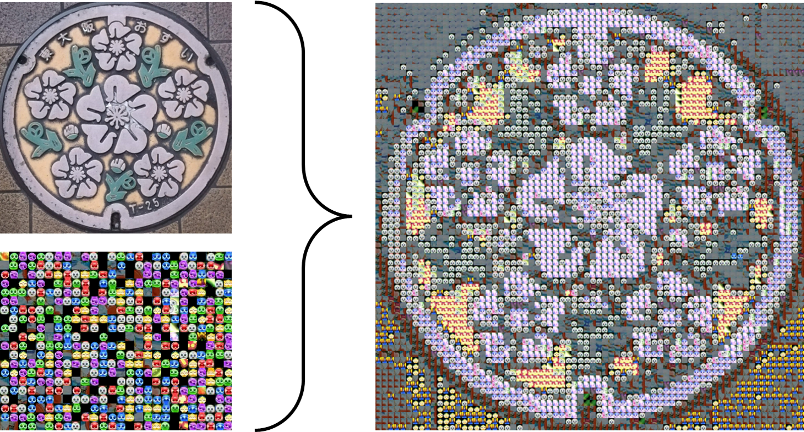

# ぷよぷよモザイクアート
ぷよぷよでモザイクアートを作ります。  
（自分で用意した画像群でもモザイクアートを作れます）  
（ブラウザ版：https://youseegreen.pythonanywhere.com/mosaic_art ）



## Requirements
- python (version 3以上なら大丈夫なはず)
- numpy
- opencv-python

## How to use
1. （初回のみ）```git clone git@github.com:youseegreen/PuyoMosaicArt.git``` 等でこのリポジトリをPCにダウンロード
2. （初回のみ）```PuyoMosaicArt```ディレクトリで```python puyoimgs_decoder.py``` を実行し、```cand_images/```に小ぷよ画像800枚を作成
3. モザイクアートを作りたい画像を```target.png```として用意
4. ```python mosaicart.py```を実行して```output.png```を生成
(mosaicartの各種変数を設定することでモザイクアートに使用する画像群の変更などが可能です)
